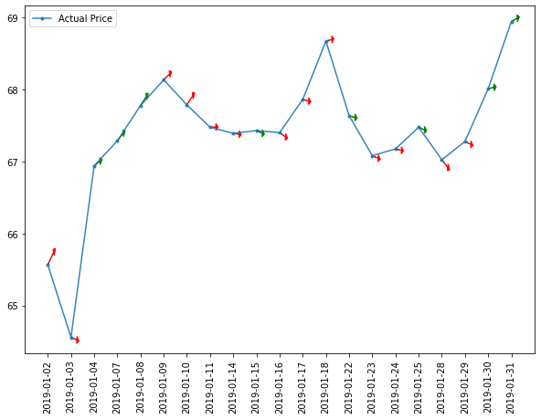

# Time Series Analysis of Historical Stock Data

This projects aims at analyzing historical stock data to predict future closing price while exhibiting good software engineering practices.

A Recurrent Neural Network, implemented with keras, will be used to predict whether a stock's closing price will be higher or lower than the closing price from the previous day.

A combination of fully connected Dense and LSTM (Long Short Term Memory) Layers are used to build a Sequential Keras model.
The model implements a Stochastic Gradient Descent algorithm to train the model with a training set consisting of stock data from days that are prior to all of the data points in the test set.
With Time Series Analysis, a model must be evaluated on its ability to make predictions on data points corresponding to dates after any and all data points in the training set. With this approach, the Recurrent Neural Network is scored on its ability to correctly predict the direction of change in the stock's Adjusted Closing Price.

# COMMAND LINE INSTRUCTIONS for a Production Level approach (Linux).

### 0. Make sure python 3.6 or greater is installed
      $ pyton --version 

### 1. Download and install Anaconda
      https://docs.anaconda.com/anaconda/install/linux/
      
### 2. Add 'conda' command to PATH.
      $ export Path=~/anaconda3/bin:$PATH
      
### 3. Initialize Anaconda then close and restart the shell
      $ conda init bash
      
### 4. Clone the TimeSeriesAnalysis project repository
      $ git clone https://github.com/AHalarewicz/TimeSeriesAnalysis.git
      
### 5. Create and activate conda virtual environment
      $ conda create --name tsenv python=3.6
      $ conda activate ~/anaconda3/envs/tsenv
      
### 6. Install/upgrage pip to install requirements for the virtual environment
      $ python3 -m pip install --user --upgrade pip  
      
### 7. Navigate to the TimeSeriesAnalysis project directory and install project modules 
      $ cd TimeSeriesAnalysis/

### 8. Install project specific environment requirements 
      $ pip install -r requirements.txt
      
### 9. Install project modules
      $ pip install -e .
      
### 10. Download historical stock data specific for the provided ticker.
      $ fetch_raw_data --ticker JPM

   Several other ticker symbols that work well with the model include [GE, XOM, BA, GOOG]

### 11. Prepare the data and format for Time Series Analysis.
      $ format_timeseries

### 12. Train the Recurrent Neural Network and predict tomorrow's change
      $ predict_tomorrow

Prediction will provided the expected change in price and insight about whether to Buy or Sell

# Makefile for a quick and easy prediction on J.P. Morgan's stock ('JPM')
### To run all of the steps sequentially, simply run the make file.
      $ make prediction    

Install requirements > Download and Format data > Train the model > Make Predictions     

# Jupyter Notebooks
## To execute code line by line, explore the jupyter notebooks
### 1. Fetch raw data with yfinance from yahoo finance:
      $ python 3
      >>> import yfinance as yf
      >>> import pandas as pd
      >>> data = yf.download("GOOG", start="2004-08-19", end="2020-04-17")
      >>> data.to_csv('../data/raw/raw.csv')
      >>> quit()
      
### 2. Wrangle data and Format for Time Series Predictions with a Recurrent Neural Network
      $ jupyter notebook

NAVIGATE TO: notebooks/data_wranglic.ipynb
      
### 3. Build, Train, and score RNN. The model will predict tomorrow's change in price and advise whether to Buy or Sell
      $ jupyer notebook

NAVIGATE TO: notebooks/LSTM_predictions.ipynb

# Sample Output
### Prediction Statistics and Tomorrow's prediction
    
      Epoch 1/2
      9595/9595 [==============================] - 5s 503us/step - loss: 0.0196
      Epoch 2/2
      9595/9595 [==============================] - 2s 234us/step - loss: 0.0018

      Prediction Quality:
      min pred:        0.9908
      max pred:        1.007
      mean pred:       1.0009
      median pred:     1.001
      percentile(1.0): 99.53
      Predicting change in stock price with 51.362398% accuracy

      Date              price_today  	price_tomorrow 	      Action               
      2020-04-15		90.790001      	90.926631    		BUY

# Visualizing Predictions 
## January 2019 Sample from the Test Set

Arrow Direction: 

      Indictates predicted direction of change in Adjusted Closing price
      
Arrow Color:

      Green: Model Correctly predicted direction of change
      Red: Model incorrectly predicted direction of change
      
# Report and Presentation slides
### Formal written report:
    reports/Capstone 2_Final_Report.pdf
    https://github.com/AHalarewicz/TimeSeriesAnalysis/blob/master/reports/Capstone_2_Final_Report.pdf
    
### Presentation for technical audience
    reports/Capstone 2_Final_Presentation.pdf
    https://github.com/AHalarewicz/TimeSeriesAnalysis/blob/master/reports/Capstone%202_Final_Presentation.pdf
        
# Important Files:
### Collect and Format Data for Time Series Analysis
      notebooks/data_wrangling.ipynb
      https://github.com/AHalarewicz/TimeSeriesAnalysis/blob/master/notebooks/data_wrangling.ipynb
      
### Train RNN with LSTM Layers and Make Predictions (Regression)
      notebooks/LSTM_predictions.ipynb
      https://github.com/AHalarewicz/TimeSeriesAnalysis/blob/master/notebooks/LSTM_predictions.ipynb
      
### Train RNN with LSTM Layers and Make Predictions (Classification)
      notebooks/LSTM_predictions.ipynb
      https://github.com/AHalarewicz/TimeSeriesAnalysis/blob/master/notebooks/LSTM_predictions.ipynb
     
### Train RNN with Dense Layers and Make Predictions (Regression)
      notebooks/LSTM_predictions.ipynb
      https://github.com/AHalarewicz/TimeSeriesAnalysis/blob/master/notebooks/LSTM_predictions.ipynb
      
      

